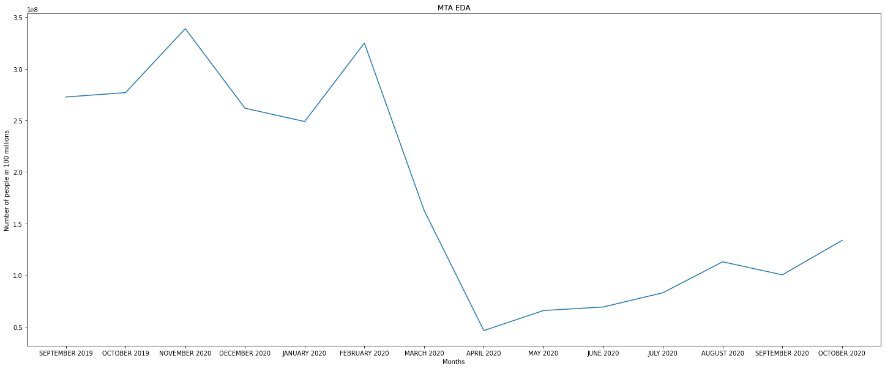

## MTA Explanatory Data Analysis 
The goal is to know whether the public transportation usage differs before and after the total lockdown that happened in New York City from March 2020 until April 2020.

I used a plot chart to display the results, the x-axis is the months and the y-axis is the number of people in 100 million.

As the figure shows, six months before march people were using public transportation more than after march, and in April the use of public transportation was at its lowest.

In conclusion, there was a change in using public transportation before and after the total lockdown. Moreover, due to the partial lockdown, people were using less public transportation than before march, and after the partial lockdown (after April), people are using public transportation less than before the total lockdown.
